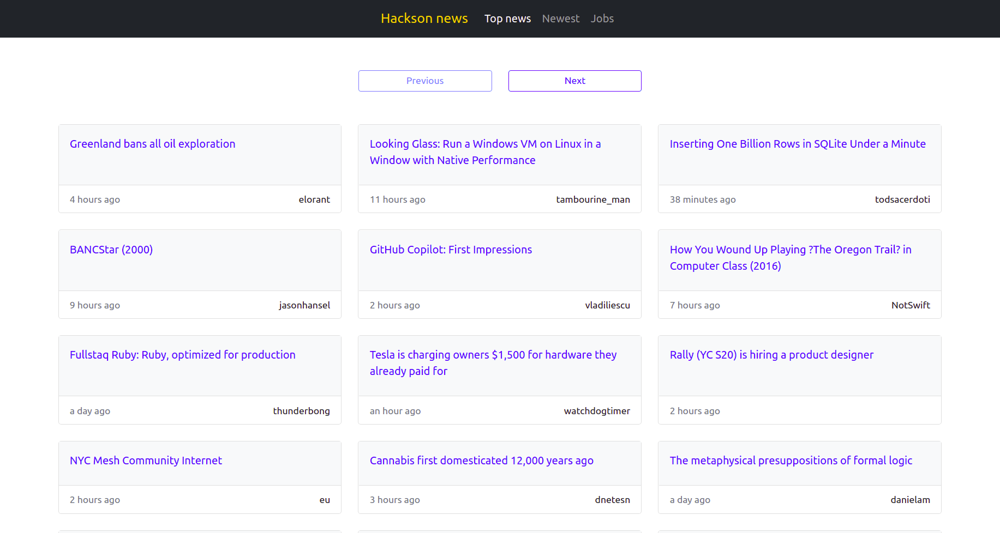

<!-- ABOUT THE PROJECT -->
 

  <h1 align="center">Hacker News Client</h2>
   
  

    <a href="https://hacker-news-tg.herokuapp.com/">View Demo</a>
  

   

## Introduction

Hacker News Client is a web application which renders news from `Hacker news` site.

## Description
This web application uses Java + Jetty on the backend and HTML5 on frontend.
The frontend refresh content without reloading the site using asynchronously fetching data from backend.

## Technologies

* Java (Jetty)
  - web servlets 
* HTML5
* CSS
* Bootstrap

## Usage

Use Heroku link: https://hacker-news-tg.herokuapp.com/

## Contact

Project Link: [https://hacker-news-tg.herokuapp.com](https://hacker-news-tg.herokuapp.com)
